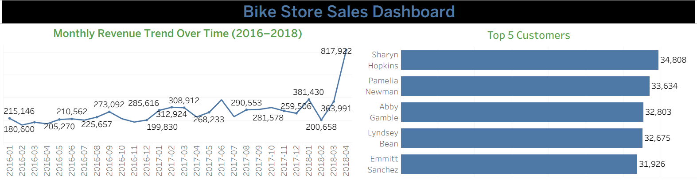
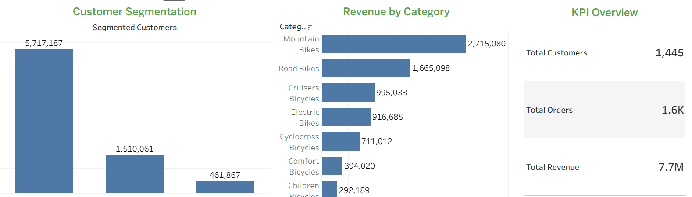

# Project Overview
This project analyzes a bike store dataset (sourced from sqlservertutorial.net) using SQL to uncover key business insights such as revenue trends, category-wise revenue, customer segmentation, and store performance. Selected insights are visualized using Tableau.

## Dataset

Dataset includes:

* customers
* orders
* staffs
* stores
* order_items
* categories
* products
* stocks
* brands

# SQL Analysis
The analysis includes:
- Total revenue, orders, customers
- Monthly revenue trends
- Revenue by category
- Customer segmentation
- Store performance ranking
- Running total of sales
- Repeat customers
- Store Wise Orders
- Stock Analysis
- Brand-wise Revenue
- Staff Performance
- Average order value

# Key Insights 

1. Revenue shows an overall increasing trend over time, with a peak in early 2018.
2. The business generated 7.7M revenue from 1.6K orders and 1,445 customers, indicating strong overall performance.
3. Mountain Bikes generate the highest revenue among all categories.
4. Average order value is 4761, indicating strong customer spending per transaction.
5. Top 2 staff members contribute the majority of total sales.
6. Trek generates much higher revenue than all other brands.
7. A few products have significantly higher stock levels compared to others.
8. Most orders come from one store, with significantly fewer orders from other stores.

# Dashboard Overview

